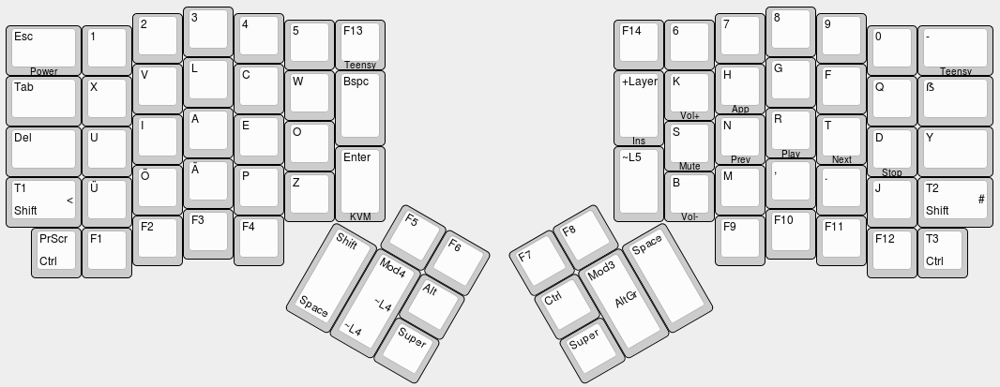

TMK Keyboard Firmware for Ergodox – Neo2 Edition
================================================

This is my fork of the popular [TMK Keyboard Firmware 
Collection](https://github.com/tmk/tmk_keyboard). Actually it is built upon 
[cub-uanic’s adaptation for the 
Ergodox](https://github.com/cub-uanic/tmk_keyboard/tree/cub_layout/keyboard/ergodox). 
I use [Neo2](http://neo-layout.org), this is my take at an Ergodox layout most 
suited for that.

Goals
-----

I like thumb keys. I like them a lot. The main task I use them for is modifiers. 
This means moving Shift, Mod3/Mod4 (Neo stuff), Ctrl, Alt and Super there. 
Because I use i3 as my window manager and rely heavily on the Super modifier, it 
has to be present on both thumb clusters. That means Ctrl and Alt are not.

Another thing I wanted to modify compared to the “original” Ergodox layout was 
the F keys. I want them to be on the default layer. As Neo2 has built in 
Navigation keys, I used the keys in the bottommost row and in the topmost row of 
the thumb clusters. The latter I can‘t reach without huge stretching anyway.

Gaming is a thing I often do in my spare time. For some of those pesky buggers, 
I have to make compromises that result in extra layers (see below).

Layers
------

The firmware has 4 “main” layers at present. More information including the 
actual keymaps can be found in [keymap_neo.h](keyboard/ergodox/keymap_neo.h).

In addition, each layer has a toggle key for Layer5 that hosts some media keys, 
a teensy key and my very own special macro that is intended to switch computers 
on my kvm switch.



[Keyboard Layout Editor link](http://www.keyboard-layout-editor.com/##@@_x:3.5;&=3&_x:10.5;&=8;&@_y:-0.875&x:2.5;&=2&_x:1;&=4&_x:8.5;&=7&_x:1;&=9;&@_y:-0.875&x:5.5;&=5&=F13%0A%0A%0A%0ATeensy&_x:4.5;&=F14&=6;&@_y:-0.875&w:1.5;&=Esc%0A%0A%0A%0APower&=1&_x:14.5;&=0&_w:1.5;&=-%0A%0A%0A%0ATeensy;&@_y:-0.375&x:3.5;&=L&_x:10.5;&=G;&@_y:-0.875&x:2.5;&=V&_x:1;&=C&_x:8.5;&=H%0A%0A%0A%0AApp&_x:1;&=F;&@_y:-0.875&x:5.5;&=W&_h:1.5;&=Bspc&_x:4.5&h:1.5;&=+Layer%0A%0A%0A%0AIns&=K%0A%0A%0A%0AVol+;&@_y:-0.875&w:1.5;&=Tab&=X&_x:14.5;&=Q&_w:1.5;&=ẞ;&@_y:-0.375&x:3.5&a:0;&=A&_x:10.5&a:4;&=R%0A%0A%0A%0APlay;&@_y:-0.875&x:2.5;&=I&_x:1;&=E&_x:8.5;&=N%0A%0A%0A%0APrev&_x:1;&=T%0A%0A%0A%0ANext;&@_y:-0.875&x:5.5;&=O&_x:6.5;&=S%0A%0A%0A%0AMute;&@_y:-0.875&w:1.5;&=Del&=U&_x:14.5;&=D%0A%0A%0A%0AStop&_w:1.5;&=Y;&@_y:-0.625&x:6.5&h:1.5;&=Enter%0A%0A%0A%0AKVM&_x:4.5&h:1.5;&=~L5;&@_y:-0.75&x:3.5;&=Ä&_x:10.5;&=,;&@_y:-0.875&x:2.5;&=Ö&_x:1;&=P&_x:8.5;&=M&_x:1;&=.;&@_y:-0.875&x:5.5;&=Z&_x:6.5;&=B%0A%0A%0A%0AVol-;&@_y:-0.875&w:1.5;&=T1%0AShift%0A%0A%0A%0A%0A%0A<&=Ü&_x:14.5;&=J&_w:1.5;&=T2%0AShift%0A%0A%0A%0A%0A%0A#;&@_y:-0.375&x:3.5;&=F3&_x:10.5;&=F10;&@_y:-0.875&x:2.5;&=F2&_x:1;&=F4&_x:8.5;&=F9&_x:1;&=F11;&@_y:-0.75&x:0.5;&=PrScr%0ACtrl&=F1&_x:14.5;&=F12&=T3%0ACtrl;&@_r:30&rx:6.5&ry:4.25&y:-1&x:1;&=F5&=F6;&@_h:2;&=Shift%0ASpace&_h:2;&=Mod4%0A~L4%0A%0A%0A%0A%0A%0A~L4&=Alt;&@_x:2;&=Super;&@_r:-30&rx:13&y:-1&x:-3;&=F7&=F8;&@_x:-3;&=Ctrl&_h:2;&=Mod3%0A%0A%0A%0A%0A%0A%0AAltGr&_h:2;&=Space;&@_x:-3;&=Super)

The layout on the image is as follows:

```
---------------------
| Layer0            |
|            Layer3 |
| Layer1            | 
---------------------
|       Layer5      |
---------------------
```

Blank Layer1/3 Slots means the key is the same as on Layer 0. Blank Layer5 slots 
are actually empty. Layer2 is basically Layer1 with QWERTZ letters. See below 
for more information.

### Layer0: Neo2 ###

Standard bread and butter layer for general purpose Neo ownage :)

### Layer1: gamer’s Neo2 ###

This layer has the left Shift thumb key replaced with space bar. The Shift keys 
move to the dead key locations on the outmost keys of the bottom row. Extra CTRL 
keys added below them. This as closely as possible mirrors standard keyboard key 
locations in order to have games usable that don’t allow (re-)mapping of certain 
keys. This mostly happens with Shift.

Additionally, Mod4 is replaced with a Layer4 toggle key. Layer4 has most of the 
features of Neo2’s software Layer4 rebuilt in hardware. This is, again, to 
increase compatibility with certain pieces of software.

### Layer2: poor man’s QWERTZ ###

Sometimes, you need _all_ of your keys in QWERTZ-like locations. This layer 
allows you to do that without switching the OS’ keyboard layout. Also, hardware 
Layer4 again.

### Layer3: poor man’s Neo2 ###

Last but not least, the “I can’t change the computers keyboard layout but I 
can’t be arsed to type QWERTZ” layer. Within the limitations of the crappy 
default German layout, this forms a pretty usable hardware implementation of 
Neo2.

LEDs
----

I re-purposed all of the three default, right-hand side, LEDs. The topmost 
formerly known as num lock one now is caps lock. This is mostly because my KVM 
switch flashes this one in command mode. The other LEDs indicate the currently 
active layer:

- no LED: Layer0
- middle LED: Layer1
- bottom LED: Layer2
- middle & bottom LED: Layer3

Firmware Download
-----------------

You can find the blobs for the latest stable version under 
[releases](https://github.com/kaimi/tmk_keyboard/releases).

Building from Source
--------------------

1. `git clone https://github.com/kaimi/tmk_keyboard`.
2. `cd tmk_keyboard/keyboard/ergodox`.
3. `make neo`.
4. Either flash manually using teensy loader or (with `teensy_loader_cli` in 
   your PATH) run `make teensy`.

Problems
--------

- Shift + Mod4 + \<key\> sucks. Granted, that pretty much only applies to Shift 
  \+ arrow keys and Shift + Insert, but it _really_ sucks.
- Ctrl + \<left hand side key\> requires both hands. But I can’t swap Ctrl and 
  Alt or Ctrl + Shift + arrow keys becomes my new worst nightmare with 3 keys to 
  press simultaneously on the left thumb cluster.
